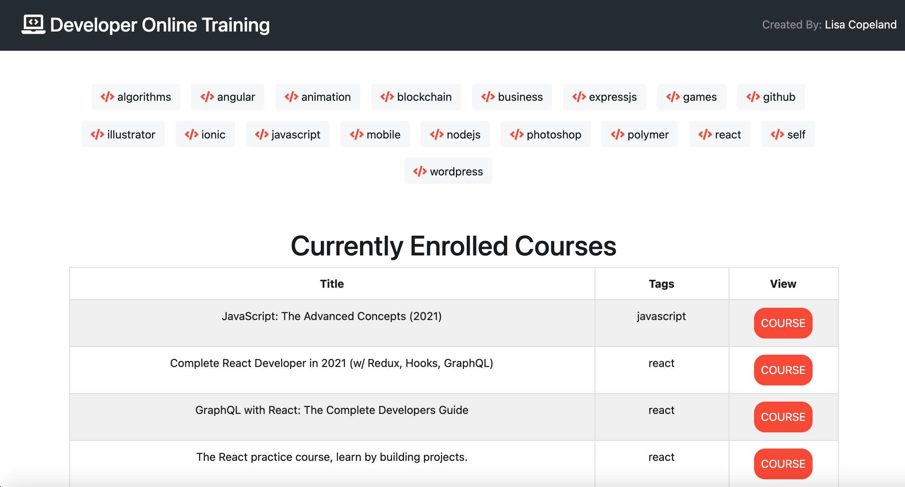

# Developer Training Online Courses 🤓

## Description 
Catalog of developer training courses built using ReactJS
- create react app
- gh pages
- react bootstrap

## Table of Contents
* [Installation](#installation)
* [Usage](#usage)
* [Credits](#credits)
* [License](#license)
* [Features](#features)
* [Contributing](#contributing)
* [Tests](#tests)
* [Badges](#badges)

## Installation
### Steps required to run locally
1. Clone/download the code in this repo
2. Navigate to the location of the code downloaded
4. Run `npm install` or `npm i` to add required packages
5. Setup dependencies
5. Run `npm start`
5. Open your browser to localhost with the port address
### Steps required to run online
Click this link to [VIEW APP](https://octo-developer-training.herokuapp.com/)

## Usage 
This code should be used for the purpose of creating/editing code for a simple portfolio website.

## View Website
Click here to view the live website [VIEW APP](https://octo-developer-training.herokuapp.com/)

## Credits
1 contributor: @stopdaydreaming  

## License
Copyright (c) Developer Online Training. All rights reserved.  
Licensed under the [MIT](LICENSE) license.

## Features
None at this time

## Contributing
None at this time

## Tests
None at this time

## Badges 
  